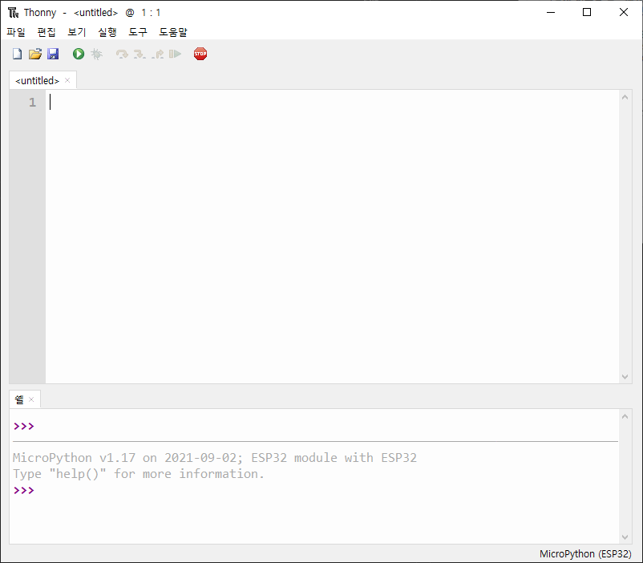

# 정보

마이크로 파이썬을 사용하는 방법에 대한 컨텐츠가 있는 폴더 입니다.

# 준비물
* 마이크로파이썬 펌웨어를 사용할 수 있는 보드  
ESP32 계열의 보드를 추천합니다.  
이 문서에서는 ESP32기반의 보드를 사용해서 진행합니다
* 마이크로파이썬 펌웨어  
다운로드 링크 : https://micropython.org/download/  
다운로드 링크(ESP32) : https://micropython.org/download/?port=esp32
* 개발도구 (thonny를 추천합니다)


# 설치
이 단계에서는 [ESP32-S NodeMCU](https://www.devicemart.co.kr/goods/view?no=1381615)를 사용합니다  


1. ESP32 펌웨어 다운로드  
    https://micropython.org/download/?port=esp32 에서 펌웨어를 다운로드 합니다  
    자신이 사용하는 ESP32보드에 맞는 펌웨어를 다운로드 합니다  
      
    해당 문서를 작성할 때 최신 버전인 [v1.17](https://micropython.org/resources/firmware/esp32-20210902-v1.17.bin)을 다운로드 합니다  

2. thonny 다운로드, 설치  
    [thonny](https://thonny.org/)를 다운로드 합니다  
    
    우측 상단의 [windows](https://github.com/thonny/thonny/releases/download/v3.3.13/thonny-3.3.13.exe)를 클릭해서 다운로드 후 설치를 합니다  
    <br>
    또는 파이썬이 설치되어 있다면 pip을 사용해서 설치를 할 수 있습니다.

    ```
    pip install thonny
    pip install esptool
    ```
3. 펌웨어 업로드  
    설치된 thonny를 실행합니다  
    pip을 이용해서 설치했다면 cmd에서 다음 커맨드를 사용해서 실행할 수 있습니다.  
    ```
    thonny

    #또는
    python -m thonny
    ```  

    thonny를 처음 실행한 모습입니다.  
    언어를 한글로 설정한 뒤 Let's go!를 클릭합니다  
      

    thonny가 성공적으로 실행된 모습입니다.
    

    실행 -> 인터프리터 선택을 클릭합니다  
    인터프리터를 MicroPython (ESP32)로 변경합니다
    

    우측 하단의 펌웨어 설치 혹은 업데이트를 클릭합니다  
    

    포트를 설정합니다  
    앞에서 다운로드한 펌웨어를 선택한 뒤 설치버튼을 클릭합니다
    

    업로드가 끝나면 인터프리터와 포트를 설정하고 확인버튼을 클릭합니다
    

4. 대화형 확인
    다음과 같이 하단에 마이크로파이썬 버전이 출력되면 정상입니다  
    
    ```
    MicroPython v1.17 on 2021-09-02; ESP32 module with ESP32
    Type "help()" for more information.
    ```

    대화형 쉘에 다음 코드를 입력합니다  
    ```
    print("hello world!")
    ```
    다음과 같은 결과를 볼 수 있습니다
    

# 발생할 수 있는 문제
    * 포트를 찾을 수 없습니다 : 사용한 칩에 따라서 추가 드라이버가 필요할 수 있습니다.  
    각 보드 칩에 맞는 드라이버를 설치합니다